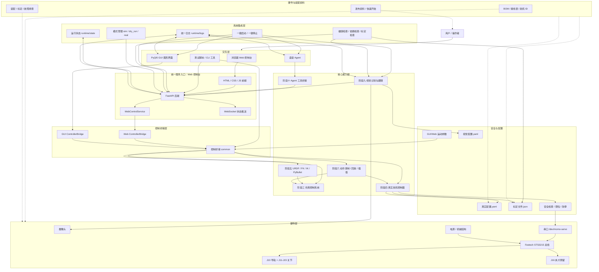
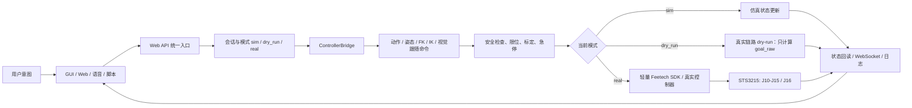
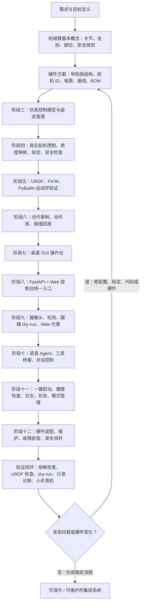

# MOMO 导轨版机械臂系统整体框图与设计流程图

本文按当前仓库结构整理，覆盖仿真、真实舵机、URDF 运动学、动作录制回放、GUI、Web、视觉、语音 Agent、系统集成和硬件资料。真实硬件控制默认遵循安全原则：先 dry-run，再小步真实动作；真实 Feetech 舵机只应由 Web API / 阶段四真实控制链路统一持有。

## 1. 系统整体框图

## 2. 运行控制链路

## 3. 设计流程图

## 4. 软件模块流程图

```mermaid
flowchart TD
    subgraph Entry["入口程序"]
        SystemStart["系统集成/一键启动.py"]
        WebStart["Web控制台/启动Web服务.py"]
        GUIStart["GUI图形界面/GUI主程序_main.py"]
        VisionStart["视觉识别与跟随/视觉主程序_main.py"]
        AgentStart["语音Agent/语音Agent主程序_main.py"]
    end

    subgraph SystemModules["系统集成模块"]
        ConfigLoader["integration/config_loader.py"]
        ProcessManager["integration/process_manager.py"]
        HealthChecker["integration/health_checker.py"]
        SafetyGuard["integration/safety_guard.py"]
        RuntimeState["integration/runtime_state.py"]
        LogManager["integration/log_manager.py"]
    end

    subgraph WebModules["Web 后端模块"]
        App["backend/app.py"]
        Service["backend/service.py"]
        Schemas["backend/schemas.py"]
        WebBridge["backend/controller_bridge.py"]
        StateManager["backend/state_manager.py"]
        WSManager["backend/websocket_manager.py"]
        StaticServer["backend/static_server.py"]
    end

    subgraph Frontend["Web 前端模块"]
        Index["frontend/index.html"]
        AppJS["frontend/app.js"]
        Styles["frontend/styles.css"]
    end

    subgraph GUIModules["GUI 模块"]
        MainWindow["gui_app/主窗口_main_window.py"]
        Pages["gui_app/页面_pages/*"]
        GUIBridge["gui_app/控制器桥接_controller_bridge.py"]
        GUIStore["gui_app/状态_store.py"]
        GUIWorkers["gui_app/后台任务_worker.py"]
        Widgets["gui_app/组件_widgets/*"]
    end

    subgraph CommonControl["公共控制与业务能力"]
        CommonBridge["控制桥接_common.py"]
        SimCore["仿真控制系统/机械臂模型_robot_arm.py"]
        PoseLib["仿真控制系统/姿态管理/*"]
        Kinematics["URDF运动学仿真/运动学模型_kinematics_model.py"]
        FKIK["URDF运动学仿真/正运动学_fk.py / 逆运动学_ik.py"]
        ActionPlayer["动作录制与回放增强/动作回放器_sequence_player.py"]
        ActionRecorder["动作录制与回放增强/动作录制器_action_recorder.py"]
    end

    subgraph RealModules["真实舵机控制模块"]
        RealController["真实机械臂控制器_real_arm_controller.py"]
        SafetyChecker["安全检查_safety_checker.py"]
        AngleMapper["角度映射_angle_mapper.py"]
        CalibrationManager["标定管理_calibration_manager.py"]
        ServoDriver["舵机驱动_servo_driver.py"]
        LightweightDriver["轻量舵机驱动_lightweight_feetech_driver.py"]
    end

    subgraph VisionModules["视觉模块"]
        VisionService["视觉服务 / latest / frame / ws"]
        Detector["人脸/手势检测"]
        FollowController["视觉跟随_controller"]
        Cinematic["运镜导演_cinematic_director.py"]
    end

    subgraph AgentModules["语音 Agent 模块"]
        AgentApp["agent/对话应用_agent_app.py"]
        SessionManager["agent/会话管理_session_manager.py"]
        STT["agent/语音转文字_stt.py"]
        TTS["agent/语音播报_tts.py"]
        ToolBridge["agent/工具桥接_tool_bridge.py"]
        RobotTools["agent/工具定义_robot_tools.py"]
    end

    subgraph ConfigData["配置与数据文件"]
        SystemConfig["系统集成/总配置.yaml"]
        WebConfig["Web控制台/Web配置.yaml"]
        GUIConfig["GUI图形界面/GUI配置.yaml"]
        RealConfig["真实舵机控制/真实配置.yaml"]
        CalibrationFile["真实舵机控制/标定文件.json"]
        VisionConfig["视觉识别与跟随/视觉配置.yaml"]
        ActionLibrary["动作录制与回放增强/动作库"]
        URDFFile["URDF运动学仿真/urdf/soarmoce_urdf.urdf"]
    end

    subgraph HardwareIO["硬件与外部 IO"]
        Camera["摄像头"]
        SerialPort["串口 /dev/momo-servo"]
        ServoBus["Feetech STS3215 J10-J15/J16"]
        AudioIO["麦克风 / 扬声器"]
        Browser["浏览器"]
    end

    SystemStart --> ConfigLoader
    ConfigLoader --> SystemConfig
    SystemStart --> ProcessManager
    ProcessManager --> WebStart
    ProcessManager --> VisionStart
    ProcessManager --> GUIStart
    ProcessManager --> AgentStart
    SystemStart --> HealthChecker
    SystemStart --> SafetyGuard
    SystemStart --> RuntimeState
    SystemStart --> LogManager

    WebStart --> App
    App --> Schemas
    App --> Service
    App --> StaticServer
    App --> WSManager
    Service --> StateManager
    Service --> WebBridge
    WebBridge --> CommonBridge
    StaticServer --> Index
    Index --> AppJS
    AppJS --> App
    Styles --> Index
    Browser --> Index

    GUIStart --> MainWindow
    MainWindow --> Pages
    Pages --> Widgets
    Pages --> GUIStore
    Pages --> GUIWorkers
    MainWindow --> GUIBridge
    GUIBridge --> CommonBridge

    CommonBridge --> SimCore
    CommonBridge --> RealController
    CommonBridge --> Kinematics
    CommonBridge --> ActionPlayer
    ActionRecorder --> ActionLibrary
    ActionPlayer --> ActionLibrary
    Kinematics --> FKIK
    Kinematics --> URDFFile
    SimCore --> PoseLib

    RealController --> SafetyChecker
    RealController --> AngleMapper
    RealController --> CalibrationManager
    RealController --> ServoDriver
    RealController --> LightweightDriver
    SafetyChecker --> RealConfig
    AngleMapper --> RealConfig
    CalibrationManager --> CalibrationFile
    ServoDriver --> SerialPort
    LightweightDriver --> SerialPort
    SerialPort --> ServoBus

    VisionStart --> VisionService
    VisionService --> Detector
    VisionService --> FollowController
    VisionService --> Cinematic
    Detector --> Camera
    FollowController --> App
    VisionService --> VisionConfig

    AgentStart --> AgentApp
    AgentApp --> SessionManager
    AgentApp --> STT
    AgentApp --> TTS
    AgentApp --> ToolBridge
    ToolBridge --> RobotTools
    RobotTools --> App
    STT --> AudioIO
    TTS --> AudioIO

    WebConfig --> Service
    GUIConfig --> MainWindow
    VisionConfig --> FollowController
    RuntimeState --> StateManager
    LogManager --> App
    LogManager --> VisionService
    LogManager --> AgentApp
    HealthChecker --> App
    HealthChecker --> VisionService
```

## 5. 核心设计约束

- 默认模式是 `dry_run`，真实硬件模式必须经过标定、安全检查和小步验证。
- 导轨版主链路关节顺序是 `j10, j11, j12, j13, j14, j15`，夹爪 `J16/gripper` 不属于主 IK 链。
- J10 是底部导轨，单位 mm；J11-J15 是关节角度，单位 deg。
- Web API 是推荐的统一控制入口；GUI、视觉、语音 Agent 和脚本都不应绕过阶段四安全控制直接写舵机 raw。
- 视觉模块负责检测和生成小步跟随意图，真实执行仍通过 Web API 与安全控制链路。
- 系统集成负责启动顺序、健康检查、运行状态、日志和 sim/dry_run/real 模式切换。
